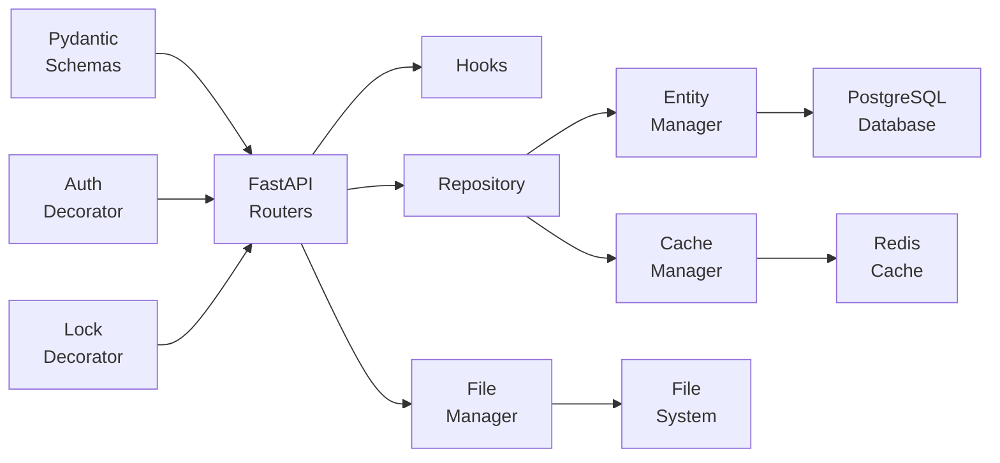

# Hidden

## How to install
Execute the command in the console:  
```
make install
```

The application is available on:  
```
http://localhost
```

The Swagger docs are available on:  
```
http://localhost/docs
```

The Sphinx docs are available on:  
```
http://localhost/sphinx/
```

## Core mechanics

```mermaid
graph LR
    AUTH[Auth<br>Decorator]
    LOCK[Lock<br>Decorator]
    PYDANTIC[Pydantic<br>Schemas]
    ROUTER[FastAPI<br>Routers]
    HOOK[Hooks]
    REPOSITORY[Repository]
    EM[Entity<br>Manager]
    CM[Cache<br>Manager]
    FM[File<br>Manager]
    POSTGRES[PostgreSQL<br>Database]
    REDIS[Redis<br>Cache]
    BINARY[File<br>System]
    ROUTER --> REPOSITORY
    REPOSITORY --> EM
    REPOSITORY --> CM
    ROUTER --> FM
    FM --> BINARY
    EM --> POSTGRES
    CM --> REDIS
    PYDANTIC --> ROUTER
    AUTH --> ROUTER
    LOCK --> ROUTER
    ROUTER --> HOOK

```

## Resources
Official website:  
[http://www.joinhidden.com/](http://www.joinhidden.com/)

Docker Hub image:  
[https://hub.docker.com/r/artabramov/hidden](http://www.joinhidden.com/)

## License
This project is licensed under the [Creative Commons Attribution-NonCommercial 4.0 International License](https://creativecommons.org/licenses/by-nc/4.0/).
