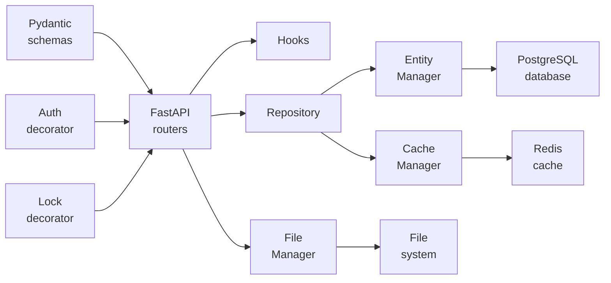
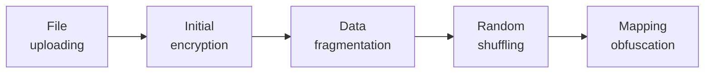

# Hidden

## How to install
Execute the command in the console:  
```
make install
```

The application is available on:  
```
http://localhost
```

The Swagger docs are available on:  
```
http://localhost/docs
```

The Sphinx docs are available on:  
```
http://localhost/sphinx
```

## Application core
The main entity handler used across all application routers is the Repository. A concrete instance of the Repository is created for each specific entity type. It handles interactions with a PostgreSQL database through an encapsulated Entity Manager and Redis cache via a Cache Manager. The primary application entities are SQLAlchemy models, and Pydantic validation schemas are used for validation across the application.

```mermaid
graph LR
    AUTH[Auth<br>decorator]
    LOCK[Lock<br>decorator]
    PYDANTIC[Pydantic<br>schemas]
    ROUTER[FastAPI<br>routers]
    HOOK[Hooks]
    REPOSITORY[Repository]
    EM[Entity<br>Manager]
    CM[Cache<br>Manager]
    FM[File<br>Manager]
    POSTGRES[PostgreSQL<br>database]
    REDIS[Redis<br>cache]
    BINARY[File<br>system]
    ROUTER --> REPOSITORY
    REPOSITORY --> EM
    REPOSITORY --> CM
    ROUTER --> FM
    FM --> BINARY
    EM --> POSTGRES
    CM --> REDIS
    PYDANTIC --> ROUTER
    AUTH --> ROUTER
    LOCK --> ROUTER
    ROUTER --> HOOK
```

## Protection mechanics
A temporary file is created for processing. Once uploaded, the file is immediately encrypted. The encrypted binary data is divided into shards, which are randomly shuffled with existing ones. The mapping and correct order of the shards are obfuscated. All operations depend on a secret key, and if it is extracted, all stored data becomes completely unusable.

```mermaid
graph LR
    UPLOAD[File<br>uploading]
    ENCRYPT[Initial<br>encryption]
    SPLIT[Data<br>fragmentation]
    SHUFFLE[Random<br>shuffling]
    OBFUSCATE[Mapping<br>obfuscation]
    UPLOAD --> ENCRYPT
    ENCRYPT --> SPLIT
    SPLIT --> SHUFFLE
    SHUFFLE --> OBFUSCATE
```

## Resources
Official website:  
[http://joinhidden.com](http://joinhidden.com)

Docker Hub image:  
[https://hub.docker.com/r/artabramov/hidden](http://www.joinhidden.com/)

## License
[Creative Commons Attribution-NonCommercial 4.0 International License](https://creativecommons.org/licenses/by-nc/4.0/).
