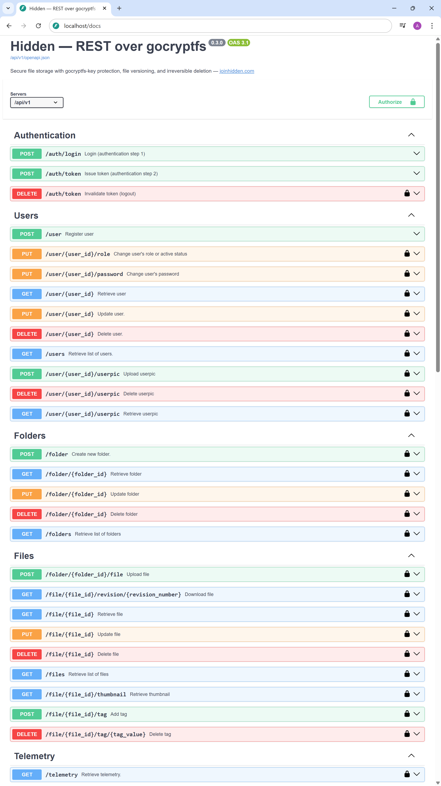

# Hidden — REST over gocryptfs


A small, fast, async, self-hosted, security-minded file-storage service built with `FastAPI`, `SQLAlchemy`, `SQLite`, and `Redis`. Internally, all data is stored in a `gocryptfs`-encrypted directory (cipher) and protected by a detachable secret key (gocryptfs passphrase). Externally, a clean `REST API` provides filesystem-like operations (upload, move, rename) and organizes files into collections. Supports file metadata and thumbnails. Versioning is built in — past file states are available as revisions. Deletion uses `shred` to securely erase files and all their revisions. A microkernel design allows hook-based `add-ons` to extend functionality without modifying the core. Out of the box, the app runs entirely inside a `Docker` container.

Source data can be imported through the API using any external tool. The encrypted data is not locked to the app — it’s exposed as a Docker volume and can be mounted directly with gocryptfs when the secret key is available.

Enforces multi-user access with role-based permissions (`RBAC`) and multi-factor authentication (`MFA`).

[](https://github.com/artabramov/hidden/blob/master/CHANGELOG.md)
[](https://github.com/artabramov/hidden/blob/master/SECURITY_SCAN.md)

[](https://github.com/artabramov/hidden/blob/master/LICENSE)

If you like it, star it ⭐ — it helps discoverability. Thank you!

## References

- Official website: [joinhidden.com](https://joinhidden.com)
- Telegram announcements: [t.me/hiddenupdates](https://t.me/hiddenupdates)
- Sphinx documentation: [github.com/artabramov/hidden-docs](https://github.com/artabramov/hidden-docs)

## Quick start

The app is delivered as a Docker image. Start it with a single command:
```bash
make install
```

On first launch, a random secret key is generated (used as the gocryptfs passphrase) and stored in a file in the `hidden-secrets` Docker volume, from which it can be extracted. Encrypted data is stored in the `hidden-data` Docker volume (plaintext is not exposed outside the container). After installation, the following URL is available:

http://localhost/docs



## Terminology

The app adopts terminology from MongoDB — collections and documents.

**Collections** — a way to organize files. Each collection maps to its own directory within gocryptfs. The structure is flat — nesting collections is not supported.

**Documents** — wrappers for files. Each document contains the file itself along with its revisions, thumbnails, and metadata.

## Threat model

The app’s prime directive is **to protect data at any cost**. It is engineered to withstand **full compromise of the host** (illegal filesystem access or physical loss/theft of the device) **without compromise of the secret key**. In that scenario, an attacker may read all on-disk data but **cannot recover original data** (assumed that the secret key is stored securely outside the app).

**Hot key extraction is supported**: the secret key can be removed without restarting the app. Upon extraction, the gocryptfs cipher directory is cleanly unmounted, and the cache is fully purged.

Without the secret key, deriving any meaningful information is **computationally infeasible**: all user data is encrypted at rest, so even with complete physical control over the storage an attacker obtains only unintelligible ciphertext blobs.

When deleted, files are securely wiped with shred (with all revisions and thumbnails). **After deletion, recovery is impossible, even if the secret key is later compromised**.

- Read more about gocryptfs: [github.com/rfjakob/gocryptfs](https://github.com/rfjakob/gocryptfs)
- Read more about shred: [en.wikipedia.org/wiki/Shred_(Unix)](https://en.wikipedia.org/wiki/Shred_(Unix))

## Caution

- **Losing the secret key permanently locks all encrypted data without the possibility of recovery**. Store the key in a secure, reliable location. Do not keep it in the same place as the app. Do not share the key with anyone.
- **On SSDs and copy-on-write/journaling filesystems, shred is ineffective** (wear-leveling and CoW defeat multi-pass overwrites). Use non-CoW filesystems and avoid snapshots.
- **Do not modify internal data manually** — this breaks data consistency. Accessing encrypted data is intended only for migration or critical recovery.

## Highlights

- **Self-hosted mode** — containerized with Docker, so it works on any hardware and operating system where a container runtime is available.
- **Isolated workspace** — no internet required. No external services, no background traffic, no analytics, no AI. For local workflows, all data is processed within the local environment — suitable for personal use and co-located teams.
- **Protected storage** — everything is encrypted, and access is controlled by a secret key that serves as the single point of trust.
- **Detachable secret key** — an external key file (gocryptfs passphrase) that can be extracted on the fly and stored separately.
- **App-agnostic volume** — the encrypted storage is exposed as a Docker volume; with the secret key, it can be mounted directly via gocryptfs or migrated to another instance of the app.
- **Irreversible deletion** — securely erases files by overwriting data multiple times to prevent recovery. Ineffective on SSDs or copy-on-write filesystems.
- **Head-based versioning** — the newest file revision is the head, any previous revision can be listed and restored. Adds disk-space overhead, but grants access to every historical state.
- **Powerful file handling** — supports file metadata, descriptions, auto-thumbnails, and cross-field search. Overall storage capacity is limited only by available disk space.
- **Multi-user access** — the app runs asynchronously and allows many users to work simultaneously. When the same data is modified, a flexible locking system prevents accidental corruption.
- **Role-based policy** — user permissions are managed by predefined roles: Reader, Author, Editor, and Admin.
- **Multi-factor auth** — login sessions are protected with one-time passwords, adding a layer of defense against credential theft.
- **Add-on friendly** — the core follows a microkernel design with a hook-based extension system, making it easy to add new features without modifying the main codebase.
- **Documentation** — detailed developer docs are generated with Sphinx, covering architecture, internals, and extension points.

## Core stack

The project’s codebase is open and available to inspect. Under the hood, it’s built with:

- **Python** — core runtime
- **FastAPI** — framework
- **Pydantic** — validation
- **SQLite** — database
- **Redis** — cache
- **gocryptfs** — encrypted FS layer
- **shred** — secure file erasure
- **unittest** — unit test runner
- **flake8** — linting
- **behave** — BDD tests (not included)
- **Sphinx** — documentation generator

## Security

The project is **regularly scanned for potential vulnerabilities**, and dependencies are kept up-to-date to address any issues found (the latest scan report is available in `SECURITY_SCAN.md`). Scanning is performed with:

- **pip-audit** — checks Python dependencies for known vulnerabilities.
- **Bandit** — performs static analysis of Python source for security issues.

If you discover a vulnerability, **please do not open a public issue**. Report it privately via GitHub’s "Report a vulnerability" (Security Advisories) or contact the maintainer directly. Include steps to reproduce and a clear impact assessment.

## Architecture overview

The app runs using virtualization inside a Docker container and can be deployed in any environment that supports it. Three volumes are exposed outside the container: one for the secrets, one for encrypted data, and one for logs (typically used for development). All data operations go through the public REST API.

The core follows a microkernel pattern: on execution, each router invokes a named hook. Add-ons intercept these hooks to extend behavior without modifying the core. Any number of add-ons can be enabled, multiple handlers may process the same hook in sequence, and add-ons are toggled via the `.env` configuration.


